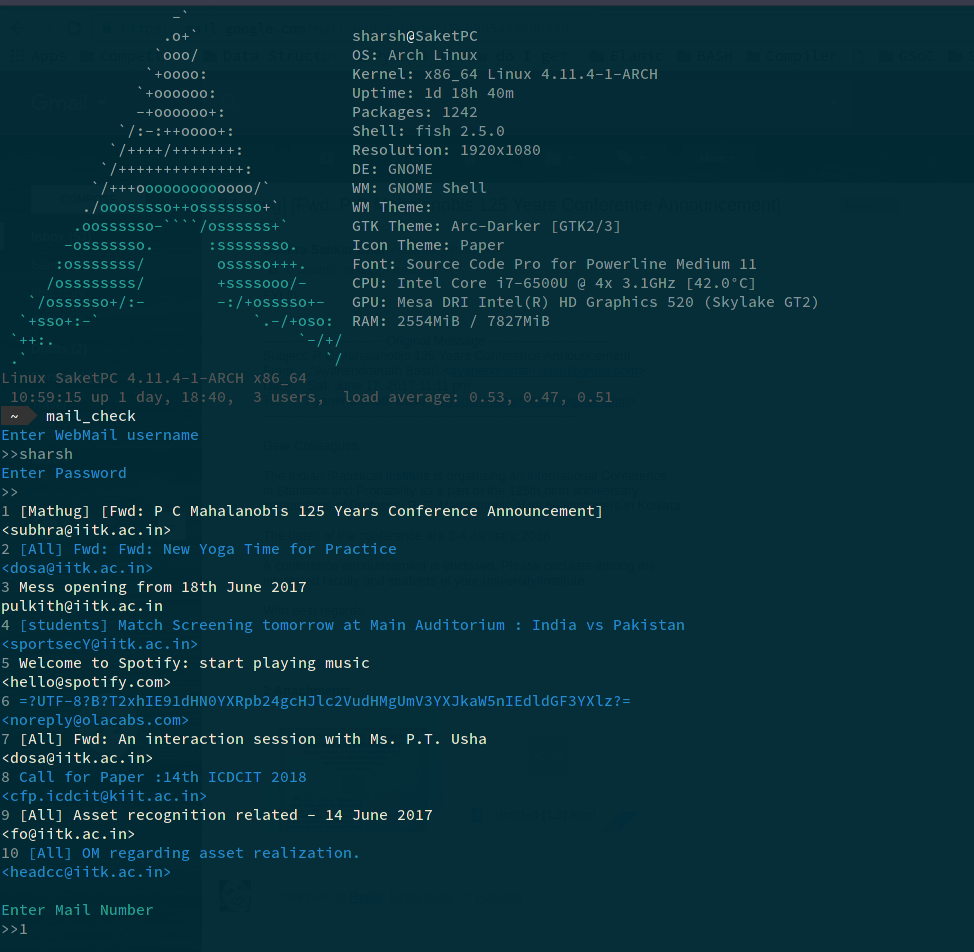

```
               .__.__                   .__                   __    
  _____ _____  |__|  |             ____ |  |__   ____   ____ |  | __
 /     \\__  \ |  |  |    ______ _/ ___\|  |  \_/ __ \_/ ___\|  |/ /
|  Y Y  \/ __ \|  |  |__ /_____/ \  \___|   Y  \  ___/\  \___|    <
|__|_|  (____  /__|____/          \___  >___|  /\___  >\___  >__|_ \

```


#### Terminal based mail-reader written purely in Python2

## Installation
* Clone the above repository.
```
git clone "https://github.com/saketharsh/mail-check.git"
```
* Go to the directory and run.
```
 pip2 install-r requirements.txt
```
* Install the package using Python2  .
```
 python2 setup.py install
 ```
* Voila !! Its done. Enjoy(use sudo wherever required)

## Usage
Currently minimal usage, for reading top 10 INBOX mail and Downloading attachments if wanted.

```
$ mail_check
$ Enter Username
$ >> sharsh
$ Enter Password
$ >>

```


## Todo
1. To extend functionality to store username and passwords too so that user does not need to type them, but password must be cryptographically saved.
2. Extend the functionality to send text-only mails too.


## Contribution
Feel free to contribute towards increasing its functionality , especially IITK students . Issues, if any can be reportd too, and corrections are welcome.
